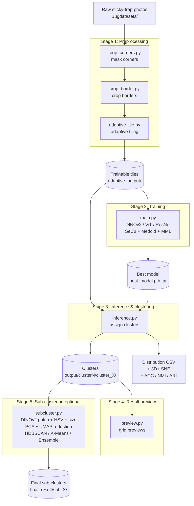

# 🪴 Melon Sticky Trap Detection

[中文](README.md) | **English**

An unsupervised deep-clustering system that automatically groups insects captured on yellow sticky traps, built for pest monitoring in melon (cantaloupe) greenhouses.

---

## Features

- **Unsupervised clustering**: Uses the SeCu (Stable Cluster Discrimination, ICCV 2023) algorithm to group insect images automatically — no manual labelling required.
- **Medoid center re-estimation**: Improves the original SeCu by replacing randomly initialized centers with top-k cosine-similarity medoids, boosting clustering stability.
- **Graph Modularity Loss (MML)**: An extra modularity loss that strengthens intra-cluster similarity and inter-cluster separation.
- **Three backbones**: ResNet-18, ViT (`vit_base_patch16_224`), and DINOv2 (`vit_base_patch14_reg4_dinov2`).
- **Full preprocessing pipeline**: From raw sticky-trap photos to trainable image tiles — corner masking, border cropping, tiling, and adaptive cropping tools included.
- **Clustering evaluation & visualization**: Outputs a 3D t-SNE visualization and a cluster-distribution CSV report; if ground-truth labels are available it also computes ACC / NMI / ARI.
- **Sub-clustering**: Splits a single cluster further by combining DINOv2 patch-level features, foreground HSV color histograms, and size/area features; after PCA + UMAP reduction it clusters with HDBSCAN / K-Means / Ensemble (multi-run consensus voting) and tags the stability of every image.
- **Mixed-precision training**: Uses PyTorch AMP (autocast + GradScaler) to speed up training.
- **TensorBoard monitoring**: Tracks loss, per-cluster sizes, and other training metrics in real time.

---

## Tech Stack

| Category | Technology |
|----------|------------|
| Language | Python 3.8+ |
| DL framework | PyTorch >= 1.6, torchvision, timm |
| Distributed training | DistributedDataParallel (DDP), gloo backend |
| Optimizers | SGD (ResNet) / AdamW (ViT / DINOv2) |
| Evaluation metrics | scikit-learn (NMI, ARI), scipy (Hungarian ACC), munkres |
| Sub-clustering & reduction | HDBSCAN, UMAP (umap-learn), scikit-learn (K-Means / Agglomerative / PCA) |
| Image processing | Pillow, NumPy, OpenCV |
| Visualization | matplotlib (t-SNE), TensorBoard |
| Data formats | `.jpg` / `.png` / `.npy` (NumPy array) |

---

## Installation

```bash
# Create a virtual environment
python -m venv venv

# Activate it
source venv/bin/activate        # Linux / macOS
venv\Scripts\activate           # Windows

# Install PyTorch (choose the build matching your CUDA version)
pip install torch torchvision --index-url https://download.pytorch.org/whl/cu124

# Install the remaining packages
pip install -r requirements.txt
```

---

## Workflow

The pipeline has five stages: **Preprocessing** → **Training** → **Inference & clustering** → **Result preview** → **Sub-clustering** (optional).



> **Note**: This is an unsupervised system — input data needs no labels. Training and inference use the same dataset: training learns the feature representation and cluster centers, while inference assigns each image to a cluster.

### Stage 1: Image preprocessing

All preprocessing scripts live in `scripts/`; run them from that directory:

```bash
# 1. Mask irrelevant corner regions (e.g. camera timestamps)
python crop_corners.py -i ../Bugdatasets -o ../masked_output --size 3000

# 2. Crop the four borders of each image
python crop_border.py -i ../masked_output -o ../cropped_border --all 100

# 3. Adaptive tiling (auto-detect non-yellow regions and crop)
python adaptive_tile.py -i ../cropped_border -o ../adaptive_output --probe 32 --padding 20
```

### Stage 2: Training

Put the preprocessed images into a subfolder under `Secu-revised/data/`. Because the learning is unsupervised, folder names are not real labels — they are just for grouping. Run from the `Secu-revised/` directory:

```bash
# First count the total number of images N
# Linux / macOS:
find ./data/adaptive_output -type f \( -name "*.jpg" -o -name "*.png" \) | wc -l
# Windows:
dir /s /b .\data\adaptive_output\*.jpg .\data\adaptive_output\*.png 2>nul | find /c /v ""

# Train (DINOv2 backbone example, N=4305, ALPHA=6*4305/50≈517)
python main.py .\data\adaptive_output -j 4 -p 10 --lr 0.01 --epochs 201 \
  --secu-num-ins 4305 --secu-alpha 517 --secu-k 8 9 10 \
  --clr 0.001 --min-crop 0.2 --log secu-dinov2 \
  --dist-url tcp://localhost:1234 \
  --multiprocessing-distributed --world-size 1 --rank 0 \
  --secu-tx 0.07 --use-medoid 1 --secu-lratio 0.7 --warm-up 30 \
  -b 64 --backbone dinov2 --secu-cst size-mml
```

> Windows users: the command must be written on a single line — `\` line continuation is not supported. If you hit a `libuv` error, run `set USE_LIBUV=0` before the training command.

**Key parameters:**

| Parameter | Description | Rule of thumb |
|-----------|-------------|---------------|
| `--secu-num-ins` | Dataset size N | Must equal the total number of training images |
| `--secu-alpha` | Constraint weight | Usually `6 × N / 50` (must not exceed per-cluster sample count) |
| `--secu-k` | Multi-head cluster counts | Provide 3 values, e.g. `8 9 10` (the count, +1, +2) |
| `--backbone` | Backbone network | `resnet18`, `vit`, or `dinov2` (recommended) |
| `--secu-cst` | Constraint type | `size`, `entropy`, or `size-mml` |
| `--use-medoid` | Enable medoid re-estimation | `1` on, `0` off |
| `--warm-up` | Warm-up epochs | Medoid kicks in only after this epoch |

Checkpoints are saved under `model/`:
- Every 50 epochs: `model/<log>_<epoch>.pth.tar`
- Best model (lowest loss): `model/best_model.pth.tar`

### Stage 3: Inference & clustering

1. Set `clusters_amount` in `config.py` (it must be one of the `--secu-k` values used during training).
2. Run inference (`--data-path` points to the training data):

```bash
python inference.py \
  --model-path model/best_model.pth.tar \
  --secu-num-ins 4305 --secu-alpha 517 --secu-k 8 9 10 \
  --secu-tx 0.07 --data-name custom \
  --backbone dinov2 \
  --data-path .\data\adaptive_output
```

Inference outputs (written to the directory set by `folder_path` in `config.py`):
- Clustered images (split into one folder per cluster)
- Cluster-distribution CSV report
- 3D t-SNE visualization
- ACC / ARI / NMI metrics if folder names correspond to real classes

> The same model can be run multiple times with different `clusters_amount` values (e.g. 8, 9, 10) to compare which cluster count fits best.

### Stage 4: Result preview

Use `scripts/preview.py` to arrange each cluster's images into a grid preview:

```bash
python ..\scripts\preview.py -i .\output\cluster9 -o .\cluster9_preview --cols 15 --rows 15 --size 128 -n 225
```

| Parameter | Description |
|-----------|-------------|
| `-i` | Clustering-result folder (containing `cluster_0/`, `cluster_1/`, …) |
| `-o` | Output folder for the preview images |
| `--cols` / `--rows` | Grid columns and rows |
| `--size` | Display size of each thumbnail (px) |
| `-n` | Max images sampled per cluster (default 100) |

### Stage 5: Sub-clustering (optional)

Each cluster from inference may still mix insects that look alike but are actually different. `scripts/subcluster.py` splits a single cluster further (or processes a whole level at once). It combines three feature sources:

- **DINOv2 patch-level features**: mean + std of patch tokens (1536-D), reduced by PCA keeping 95% of variance automatically
- **Foreground HSV color histogram**: 64 bins × 3 channels + color statistics (199-D), with the yellow background automatically excluded
- **Size/area features**: foreground ratio, bounding-box aspect ratio, foreground mean brightness (3-D)

The three are L2-normalized, weighted, concatenated, then reduced with **UMAP (cosine)** and clustered by one of the methods below. Run from `scripts/`:

```bash
# HDBSCAN: auto-determine the number of sub-clusters (recommended); noise is merged into the nearest sub-cluster
python subcluster.py -i ../Secu-revised/output/cluster8/cluster_0 --method hdbscan --preview

# Ensemble: run HDBSCAN multiple times with different params and decide the final split via a consensus matrix (most stable);
#           also tags each image's stability (unstable ones go to uncertain/)
python subcluster.py -i ../Secu-revised/output/cluster8/cluster_0 --method ensemble --preview

# K-Means: specify K manually (multiple allowed; compared by Silhouette Score)
python subcluster.py -i ../Secu-revised/output/cluster8/cluster_0 --method kmeans -k 2 3 4 5 --preview

# --all: process every cluster_X subfolder under input at once (auto-excludes _subcluster),
#        with -o setting a single shared output root
python subcluster.py -i ../Secu-revised/output/cluster8 --all --method hdbscan --preview -o ../final_result
```

| Parameter | Description |
|-----------|-------------|
| `--method` | `hdbscan` (auto K) / `ensemble` (multi-vote, most stable) / `kmeans` (manual K) |
| `--all` | Run once per `cluster_X` subfolder under input (auto-excludes folders containing `subcluster`) |
| `-o` | Output root (default `<input>_subcluster`) |
| `-k` | K values for K-Means (multiple allowed) |
| `--min-cluster-size` / `--min-samples` | HDBSCAN params (auto-retries with smaller values if too few sub-clusters, finally falls back to K-Means k=2) |
| `--color-weight` / `--size-weight` | Color / size feature weights (0 = off, 1 = equal, >1 = dominant) |
| `--preview` | Generate a grid preview per sub-cluster (`--preview-cols/-rows/-size` adjustable) |

Output layout (HDBSCAN example):

```
<input>_subcluster/
├── hdbscan/              # or k3/, ensemble/
│   ├── sub_0/
│   ├── sub_1/
│   ├── noise/            # HDBSCAN noise (may be empty once merged into nearest sub-cluster)
│   └── uncertain/        # ensemble only: images with stability < 0.4
└── hdbscan_preview/      # per-sub-cluster previews when --preview is set
```

> Sub-clustering uses a **frozen (pretrained, not fine-tuned)** DINOv2 — no retraining needed; it post-processes SeCu clustering results directly.

---

## Helper Tools

| Script | Description | Example |
|--------|-------------|---------|
| `scripts/count_image.py` | Count images per subfolder | `python count_image.py ../Secu-revised/data/train` |
| `scripts/preview.py` | Arrange subfolder images into a grid preview | `python preview.py -i ../output/cluster9` |
| `scripts/subcluster.py` | Sub-cluster a single cluster (HDBSCAN / K-Means / Ensemble) | `python subcluster.py -i ../Secu-revised/output/cluster8/cluster_0 --method hdbscan --preview` |
| `Secu-revised/count_parcel.py` | Dataset sampling & label generation | See in-script docs |

---

## Project Structure

```
.
├── Secu-revised/              # Core ML: SeCu deep clustering
│   ├── main.py                # Training entry (ResNet / ViT / DINOv2, with MML loss)
│   ├── inference.py           # Inference & clustering (t-SNE viz, distribution report)
│   ├── config.py              # Global settings (clusters_amount, output paths)
│   ├── count_parcel.py        # Dataset tool (sampling, label generation)
│   ├── nets/                  # Backbone architectures
│   │   ├── resnet_cifar.py    #   ResNet-18 (CIFAR / 224×224)
│   │   ├── resnet_stl.py      #   ResNet-18 (STL-10)
│   │   ├── resnet_custom.py   #   ResNet-18 (custom dataset)
│   │   └── vit.py             #   ViT / DINOv2 wrappers
│   ├── secu/                  # SeCu algorithm modules
│   │   ├── builder.py         #   SeCu model definition (medoid + MML)
│   │   ├── folder.py          #   Custom Dataset (ImageFolder / NPYFolder)
│   │   └── loader.py          #   Data augmentation (crop, blur, solarize)
│   ├── data/                  # Image data (gitignored)
│   ├── model/                 # Model checkpoints (gitignored)
│   ├── output/                # Clustering output
│   └── result/                # Inference text results
│
├── scripts/                   # Image preprocessing & utilities
│   ├── crop_corners.py        #   Batch-mask image corners
│   ├── crop_border.py         #   Crop image borders
│   ├── adaptive_tile.py       #   Adaptively detect non-yellow regions and crop
│   ├── count_image.py         #   Count images per subfolder
│   ├── preview.py             #   Grid preview of subfolder images
│   └── subcluster.py          #   Cluster sub-clustering (DINOv2+HSV+UMAP, HDBSCAN/K-Means/Ensemble)
│
├── requirements.txt           # Python dependencies
├── README.md                  # Chinese documentation
└── README.en.md               # English documentation (this file)
```

### Data directory format

```
data/
└── adaptive_output/       # or any subfolder structure
    ├── source_A/
    │   ├── img_001.jpg
    │   └── ...
    └── source_B/
        └── ...
```

> Folder names do not affect training (it is unsupervised), but during inference they serve as ground truth for computing evaluation metrics. If you have no real labels, just place images in any subfolder.

Supported formats: `.jpg`, `.jpeg`, `.png`, `.npy` (NumPy array, shape: H×W×C, uint8)

---

## Clustering Results

Results from one full inference run (DINOv2 backbone, `clusters_amount=8`, N=4305). The raw per-image cluster assignments are in [`Secu-revised/result/植保溫室-洋香瓜.txt`](Secu-revised/result/植保溫室-洋香瓜.txt) (format: `source_group,cluster`).

- **Total images**: 4305
- **Source groups**: 925 (sticky-trap / photo IDs)
- **Clusters**: 8 (cluster 0–7)

| Cluster | Images | Share |
|---------|--------|-------|
| 0 | 862 | 20.0% |
| 1 | 524 | 12.2% |
| 2 | 745 | 17.3% |
| 3 | 329 | 7.6% |
| 4 | 480 | 11.1% |
| 5 | 649 | 15.1% |
| 6 | 370 | 8.6% |
| 7 | 346 | 8.0% |
| **Total** | **4305** | **100%** |

### Per-cluster previews

| cluster 0 | cluster 1 | cluster 2 | cluster 3 |
|:---:|:---:|:---:|:---:|
|  |  |  |  |
| **cluster 4** | **cluster 5** | **cluster 6** | **cluster 7** |
|  |  |  |  |

> Full-resolution previews are in `Secu-revised/cluster8_preview/`.

---

## Citation

The clustering algorithm in this project is based on the following paper:

```bibtex
@inproceedings{qian2023secu,
  author    = {Qi Qian},
  title     = {Stable Cluster Discrimination for Deep Clustering},
  booktitle = {{IEEE/CVF} International Conference on Computer Vision, {ICCV} 2023},
  year      = {2023}
}
```
