# 🪴 Melon Sticky Trap Detection

**中文** | [English](README.en.md)

基於無監督深度聚類的黃色黏蟲板昆蟲自動分群系統，應用於洋香瓜溫室害蟲監測。

---

## 功能特色

- **無監督聚類**：採用 SeCu（Stable Cluster Discrimination, ICCV 2023）演算法，無需人工標註即可將昆蟲影像自動分群
- **Medoid 中心重估**：改良原始 SeCu，以 top-k cosine similarity medoid 取代隨機初始化中心，提升聚類穩定性
- **Graph Modularity Loss (MML)**：額外引入圖模組化損失，強化群內相似度與群間分離度
- **三種骨幹支援**：ResNet-18、ViT (vit_base_patch16_224)、DINOv2 (vit_base_patch14_reg4_dinov2)
- **完整前處理流程**：從原始黏蟲板照片到可訓練的圖塊資料，提供角落遮蔽、邊框裁切、圖塊切割、自適應裁切等工具
- **聚類評估與視覺化**：輸出 t-SNE 3D 視覺化與聚類分佈 CSV 報告；若提供 Ground Truth 標籤可額外計算 ACC / NMI / ARI
- **子聚類細分**：對單一 cluster 做二次細分，結合 DINOv2 patch-level 特徵、前景 HSV 顏色直方圖與大小/面積特徵，經 PCA + UMAP 降維後以 HDBSCAN / K-Means / Ensemble（多次投票共識）聚類，並標記每張影像的穩定度
- **混合精度訓練**：使用 PyTorch AMP (autocast + GradScaler) 加速訓練
- **TensorBoard 監控**：即時追蹤 loss、各群大小等訓練指標

---

## 技術架構

| 類別 | 技術 |
|------|------|
| 語言 | Python 3.8+ |
| 深度學習框架 | PyTorch >= 1.6、torchvision、timm |
| 分散式訓練 | DistributedDataParallel (DDP)、gloo backend |
| 優化器 | SGD (ResNet) / AdamW (ViT / DINOv2) |
| 評估指標 | scikit-learn (NMI, ARI)、scipy (Hungarian ACC)、munkres |
| 子聚類與降維 | HDBSCAN、UMAP (umap-learn)、scikit-learn (K-Means / Agglomerative / PCA) |
| 影像處理 | Pillow、NumPy、OpenCV |
| 視覺化 | matplotlib (t-SNE)、TensorBoard |
| 資料格式 | `.jpg` / `.png` / `.npy` (NumPy array) |

---

## 環境安裝

```bash
# 建立虛擬環境
python -m venv venv

# 啟動虛擬環境
source venv/bin/activate        # Linux / macOS
venv\Scripts\activate           # Windows

# 安裝 PyTorch（根據 CUDA 版本選擇）
pip install torch torchvision --index-url https://download.pytorch.org/whl/cu124

# 安裝其餘套件
pip install -r requirements.txt
```

---

## 操作流程

整體流程分為五個階段：**影像前處理** → **模型訓練** → **推論與分群** → **結果預覽** → **子聚類細分**（選用）。

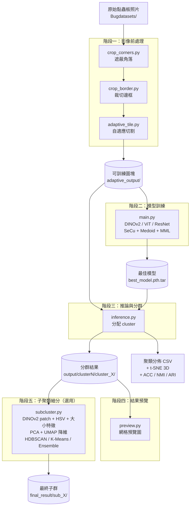

> **注意**：本系統為無監督聚類，輸入資料不需要標籤。訓練與推論使用同一批資料 — 訓練階段學習特徵表示與群中心，推論階段將每張影像分配到對應的 cluster。

### 階段一：影像前處理

原始黏蟲板照片有兩個主要問題會影響後續切片與聚類，前處理依序解決：

| 問題 | 解決方式 | 對應腳本 |
|---|---|---|
| **原始圖片有灰色邊框**：邊框區域不是有效的黃色黏蟲板，會干擾自適應切割 | 將四邊的灰色邊框去掉，留下純黃色黏蟲板區域 | `crop_border.py` |
| **黏蟲板上的打洞處會被誤判為昆蟲**：自適應切割是以「非黃色區域」當作昆蟲，打洞處的白色也會被切下來 | 把右上角與右下角各 3000×3000 px 的打洞區域塗黑，讓自適應切割略過 | `crop_corners.py` |

<p align="center">
  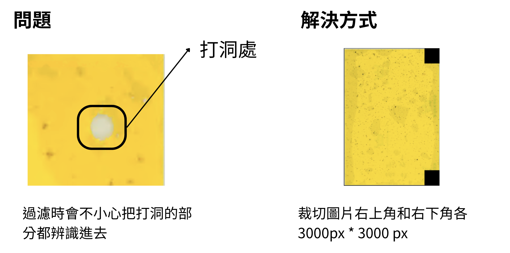
  &nbsp;&nbsp;
  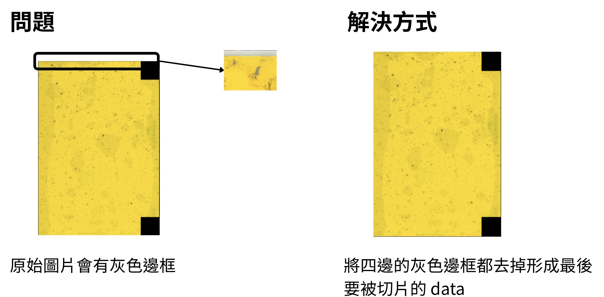
</p>

所有前處理腳本位於 `scripts/` 目錄，從 `scripts/` 目錄執行：

```bash
# 1. 遮蔽角落打洞處
python crop_corners.py -i ../Bugdatasets -o ../masked_output --size 3000

# 2. 裁切圖片四邊灰色邊框
python crop_border.py -i ../masked_output -o ../cropped_border --all 100

# 3. 自適應切割（自動偵測非黃色區域並裁切）
python adaptive_tile.py -i ../cropped_border -o ../adaptive_output --probe 32 --padding 20
```

### 階段二：模型訓練

將前處理後的影像放入 `Secu-revised/data/` 目錄下的子資料夾。由於是無監督學習，資料夾名稱不代表真實標籤，僅作為分組用途。從 `Secu-revised/` 目錄執行：

```bash
# 先計算圖片總數 N
# Linux / macOS:
find ./data/adaptive_output -type f \( -name "*.jpg" -o -name "*.png" \) | wc -l
# Windows:
dir /s /b .\data\adaptive_output\*.jpg .\data\adaptive_output\*.png 2>nul | find /c /v ""

# 訓練（以 DINOv2 backbone 為例，N=4305, ALPHA=6*4305/50≈517）
python main.py .\data\adaptive_output -j 4 -p 10 --lr 0.01 --epochs 201 \
  --secu-num-ins 4305 --secu-alpha 517 --secu-k 8 9 10 \
  --clr 0.001 --min-crop 0.2 --log secu-dinov2 \
  --dist-url tcp://localhost:1234 \
  --multiprocessing-distributed --world-size 1 --rank 0 \
  --secu-tx 0.07 --use-medoid 1 --secu-lratio 0.7 --warm-up 30 \
  -b 64 --backbone dinov2 --secu-cst size-mml
```

> Windows 使用者注意：指令必須寫成一行，不支援 `\` 換行。若遇到 `libuv` 錯誤，在訓練指令前執行 `set USE_LIBUV=0`。

**關鍵參數說明：**

| 參數 | 說明 | 設定規則 |
|------|------|----------|
| `--secu-num-ins` | 資料集總數 N | 必須等於訓練影像總張數 |
| `--secu-alpha` | 約束權重 | 通常設為 `6 × N / 50`（不超過每類樣本數） |
| `--secu-k` | 多頭聚類數量 | 設定 3 個值，如 `8 9 10`（類別數、+1、+2） |
| `--backbone` | 骨幹網路 | `resnet18`、`vit` 或 `dinov2`（推薦） |
| `--secu-cst` | 約束類型 | `size`、`entropy` 或 `size-mml` |
| `--use-medoid` | 啟用 medoid 中心重估 | `1` 啟用、`0` 關閉 |
| `--warm-up` | Warm-up epoch 數 | medoid 在此 epoch 後才啟動 |

模型檢查點儲存於 `model/` 目錄：
- 每 50 個 epoch 儲存一次：`model/<log>_<epoch>.pth.tar`
- 最佳模型（最低 loss）：`model/best_model.pth.tar`

### 階段三：推論與分群

1. 修改 `config.py` 中的 `clusters_amount`（必須是訓練時 `--secu-k` 的其中一個值）
2. 執行推論（`--data-path` 指向訓練資料路徑）：

```bash
python inference.py \
  --model-path model/best_model.pth.tar \
  --secu-num-ins 4305 --secu-alpha 517 --secu-k 8 9 10 \
  --secu-tx 0.07 --data-name custom \
  --backbone dinov2 \
  --data-path .\data\adaptive_output
```

推論輸出（存放於 `config.py` 中 `folder_path` 指定的目錄）：
- 分群後的影像（依 cluster 分資料夾存放）
- 聚類分佈 CSV 報告
- t-SNE 3D 視覺化圖表
- 若資料夾名稱對應真實類別，會額外計算 ACC / ARI / NMI 指標

> 同一個模型可以用不同的 `clusters_amount` 多次推論（例如分別設 8、9、10），比較哪個分群數最合適。

### 階段四：結果預覽

使用 `scripts/preview.py` 將每個 cluster 的圖片排成網格預覽圖：

```bash
python ..\scripts\preview.py -i .\output\cluster9 -o .\cluster9_preview --cols 15 --rows 15 --size 128 -n 225
```

| 參數 | 說明 |
|------|------|
| `-i` | 分群結果資料夾（含 `cluster_0/`、`cluster_1/` 等子資料夾） |
| `-o` | 預覽圖輸出資料夾 |
| `--cols` / `--rows` | 網格的列數與行數 |
| `--size` | 每張圖的顯示大小（px） |
| `-n` | 每個 cluster 最多抽幾張（預設 100） |

### 階段五：子聚類細分（選用）

推論得到的每個 cluster 內，可能還混雜了形態相近但實際不同的昆蟲。`scripts/subcluster.py` 可對單一 cluster（或一次處理整層）做二次細分。它結合三種特徵：

- **DINOv2 patch-level 特徵**：patch tokens 的 mean + std（1536 維），經 PCA 自動保留 95% 變異量
- **前景 HSV 顏色直方圖**：64 bins × 3 通道 + 顏色統計量（199 維），自動排除黃色背景
- **大小/面積特徵**：前景佔比、bounding box 長寬比、前景平均亮度（3 維）

三者 L2-normalize 加權拼接後以 **UMAP（cosine）** 降維，再用以下任一方法聚類。從 `scripts/` 目錄執行：

```bash
# HDBSCAN：自動決定子群數（推薦），噪點自動併入最近子群
python subcluster.py -i ../Secu-revised/output/cluster8/cluster_0 --method hdbscan --preview

# Ensemble：用不同參數跑多次 HDBSCAN，以共識矩陣決定最終分群，最穩定
#           並標記每張圖的穩定度（不穩定者另放 uncertain/）
python subcluster.py -i ../Secu-revised/output/cluster8/cluster_0 --method ensemble --preview

# K-Means：手動指定 K（可多個，依 Silhouette Score 比較哪個 K 最好）
python subcluster.py -i ../Secu-revised/output/cluster8/cluster_0 --method kmeans -k 2 3 4 5 --preview

# --all：一次處理某層底下所有 cluster_X 子資料夾（自動排除 _subcluster），
#        並用 -o 指定統一輸出根目錄
python subcluster.py -i ../Secu-revised/output/cluster8 --all --method hdbscan --preview -o ../final_result
```

| 參數 | 說明 |
|------|------|
| `--method` | `hdbscan`（自動 K）/ `ensemble`（多次投票最穩）/ `kmeans`（手動 K） |
| `--all` | 對 input 底下所有 `cluster_X` 子資料夾各跑一次（自動排除含 `subcluster` 的資料夾） |
| `-o` | 輸出根目錄（預設 `<input>_subcluster`） |
| `-k` | K-Means 的 K 值（可多個） |
| `--min-cluster-size` / `--min-samples` | HDBSCAN 參數（子群不足時會自動降低重試，最終 fallback 到 K-Means k=2） |
| `--color-weight` / `--size-weight` | 顏色 / 大小特徵權重（0=不用、1=等權重、>1=主導） |
| `--preview` | 為每個子群輸出網格預覽圖（`--preview-cols/-rows/-size` 可調） |

輸出結構（以 HDBSCAN 為例）：

```
<input>_subcluster/
├── hdbscan/              # 或 k3/、ensemble/
│   ├── sub_0/
│   ├── sub_1/
│   ├── noise/            # HDBSCAN 噪點（已併入最近子群時可能為空）
│   └── uncertain/        # 僅 ensemble：穩定度 < 0.4 的影像
└── hdbscan_preview/      # --preview 時產生的各子群預覽圖
```

> 子聚類完全使用 **frozen（預訓練、不微調）** 的 DINOv2，不需要重新訓練模型，可直接對 SeCu 分群結果做後處理。

#### 子聚類效果範例

下圖示範對某個第一階段 cluster 進行 HDBSCAN 子聚類後的結果，可看到原本混雜在同一群的影像被進一步細分成幾個更純淨的子群：

<p align="center">
  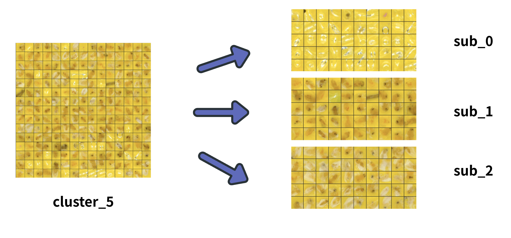
</p>

---

## 輔助工具

| 腳本 | 說明 | 範例 |
|------|------|------|
| `scripts/count_image.py` | 統計各子資料夾的圖片數量 | `python count_image.py ../Secu-revised/data/train` |
| `scripts/preview.py` | 將子資料夾圖片排成網格預覽圖 | `python preview.py -i ../output/cluster9` |
| `scripts/subcluster.py` | 對單一 cluster 做子聚類細分（HDBSCAN / K-Means / Ensemble） | `python subcluster.py -i ../Secu-revised/output/cluster8/cluster_0 --method hdbscan --preview` |
| `Secu-revised/count_parcel.py` | 資料集抽樣與標籤產生 | 詳見腳本內說明 |

---

## 目錄結構

```
.
├── Secu-revised/              # 核心 ML：SeCu 深度聚類
│   ├── main.py                # 訓練入口（ResNet / ViT / DINOv2，含 MML 損失）
│   ├── inference.py           # 推論與分群（t-SNE 視覺化、聚類分佈報告）
│   ├── config.py              # 全域設定（clusters_amount、輸出路徑）
│   ├── count_parcel.py        # 資料集工具（抽樣、標籤產生）
│   ├── nets/                  # 骨幹網路架構
│   │   ├── resnet_cifar.py    #   ResNet-18（CIFAR / 224×224）
│   │   ├── resnet_stl.py      #   ResNet-18（STL-10）
│   │   ├── resnet_custom.py   #   ResNet-18（自訂資料集）
│   │   └── vit.py             #   ViT / DINOv2 封裝
│   ├── secu/                  # SeCu 演算法模組
│   │   ├── builder.py         #   SeCu 模型定義（medoid + MML）
│   │   ├── folder.py          #   自訂 Dataset（ImageFolder / NPYFolder）
│   │   └── loader.py          #   資料增強（裁切、模糊、曝光反轉）
│   ├── data/                  # 影像資料（gitignored）
│   ├── model/                 # 模型檢查點（gitignored）
│   ├── output/                # 分群結果輸出
│   └── result/                # 推論文字結果
│
├── scripts/                   # 影像前處理與工具
│   ├── crop_corners.py        #   批次遮蔽圖片角落
│   ├── crop_border.py         #   裁切圖片四邊邊框
│   ├── adaptive_tile.py       #   自適應偵測非黃色區域並裁切
│   ├── count_image.py         #   統計各子資料夾圖片數量
│   ├── preview.py             #   子資料夾圖片網格預覽
│   └── subcluster.py          #   cluster 子聚類細分（DINOv2+HSV+UMAP，HDBSCAN/K-Means/Ensemble）
│
├── requirements.txt           # Python 套件依賴
└── README.md
```

### 資料目錄格式

```
data/
└── adaptive_output/       # 或任何子資料夾結構
    ├── source_A/
    │   ├── img_001.jpg
    │   └── ...
    └── source_B/
        └── ...
```

> 資料夾名稱在訓練時不影響聚類結果（無監督），但在推論時會作為 Ground Truth 用於計算評估指標。若無真實標籤，放在任意子資料夾即可。

支援格式：`.jpg`、`.jpeg`、`.png`、`.npy`（NumPy array, shape: H×W×C, uint8）

---

## 分群結果

以下為一次完整推論的分群結果（DINOv2 backbone、`clusters_amount=8`、N=4305）。原始的每張影像 cluster 指派紀錄見 [`Secu-revised/result/植保溫室-洋香瓜.txt`](Secu-revised/result/植保溫室-洋香瓜.txt)（格式：`來源群組,cluster`）。

- **總影像數**：4305
- **來源群組數**：925（黏蟲板 / 照片 ID）
- **分群數**：8（cluster 0–7）

| cluster | 張數 | 佔比 |
|---------|------|------|
| 0 | 862 | 20.0% |
| 1 | 524 | 12.2% |
| 2 | 745 | 17.3% |
| 3 | 329 | 7.6% |
| 4 | 480 | 11.1% |
| 5 | 649 | 15.1% |
| 6 | 370 | 8.6% |
| 7 | 346 | 8.0% |
| **合計** | **4305** | **100%** |

### 各群預覽

| cluster 0 | cluster 1 | cluster 2 | cluster 3 |
|:---:|:---:|:---:|:---:|
| 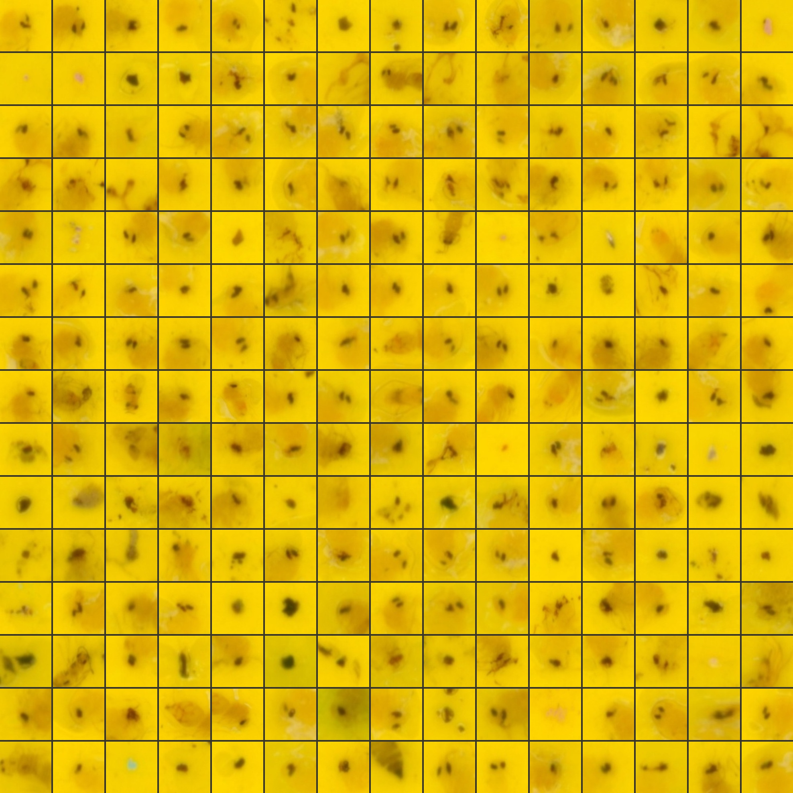 | 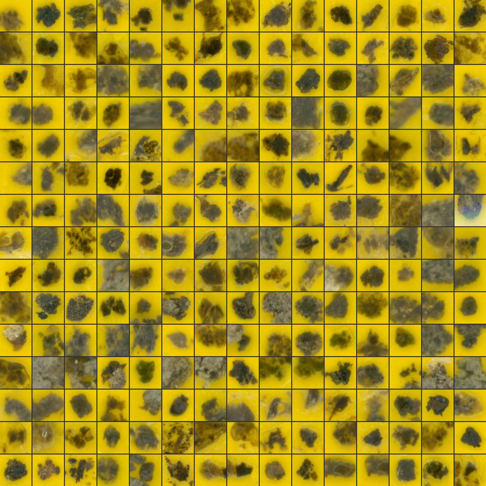 | 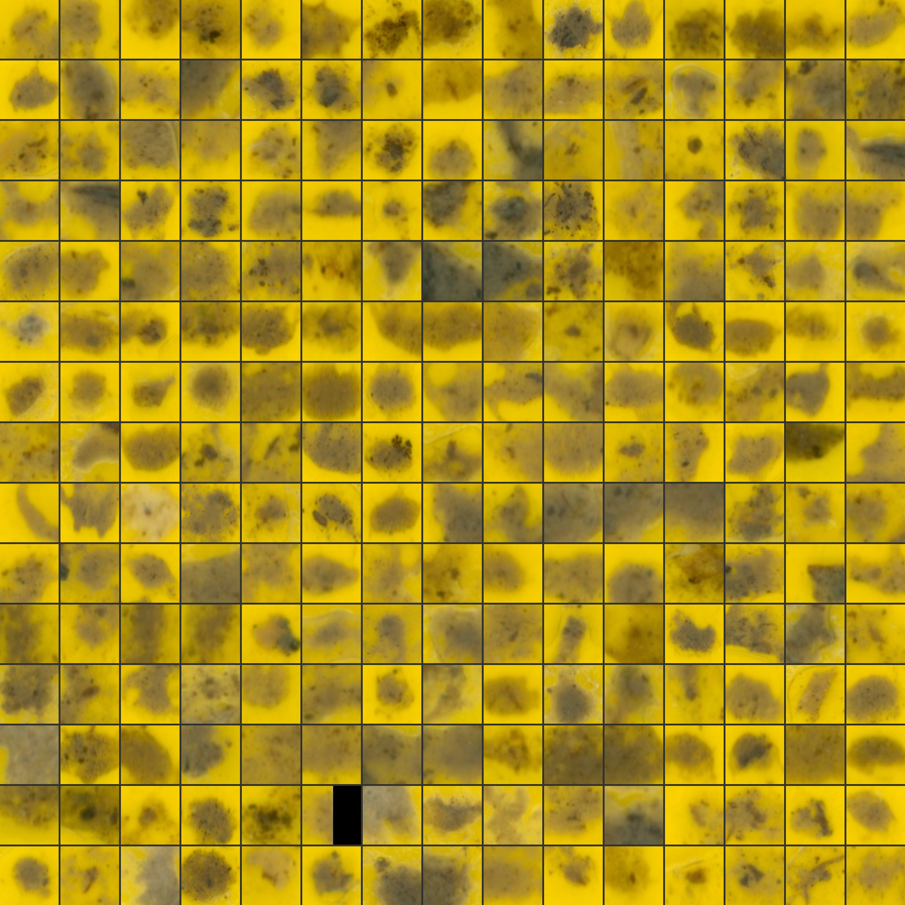 | 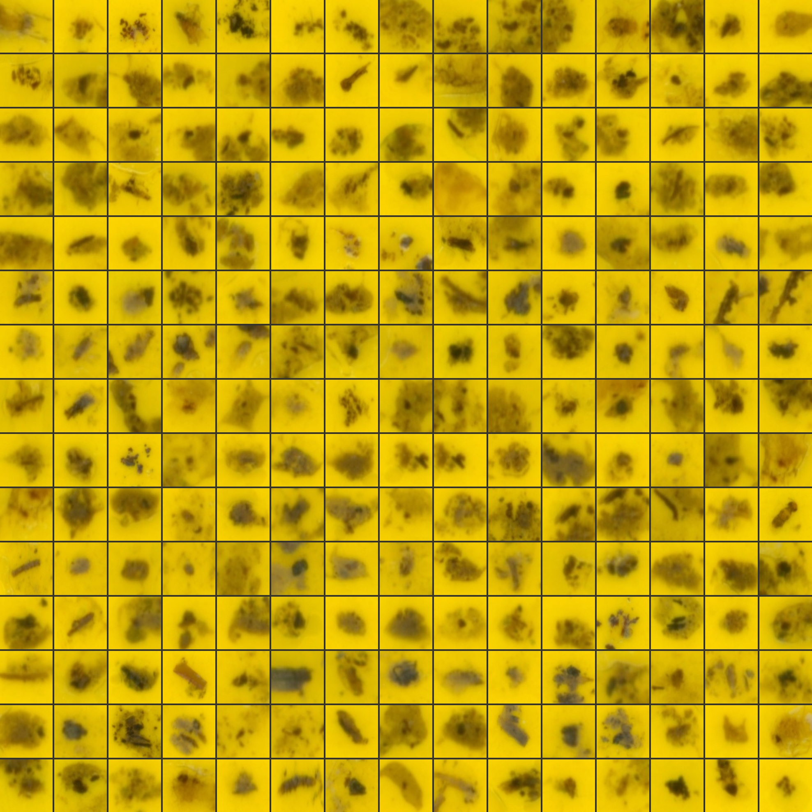 |
| **cluster 4** | **cluster 5** | **cluster 6** | **cluster 7** |
| 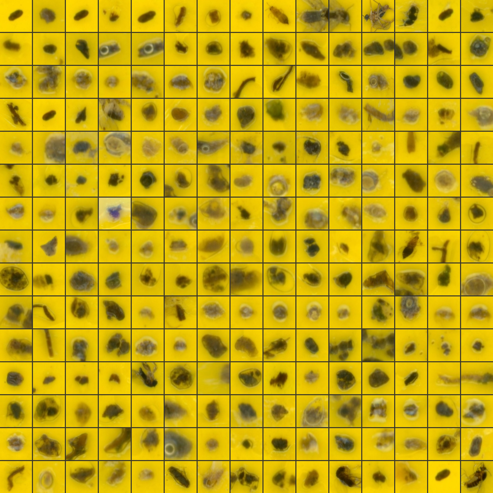 | 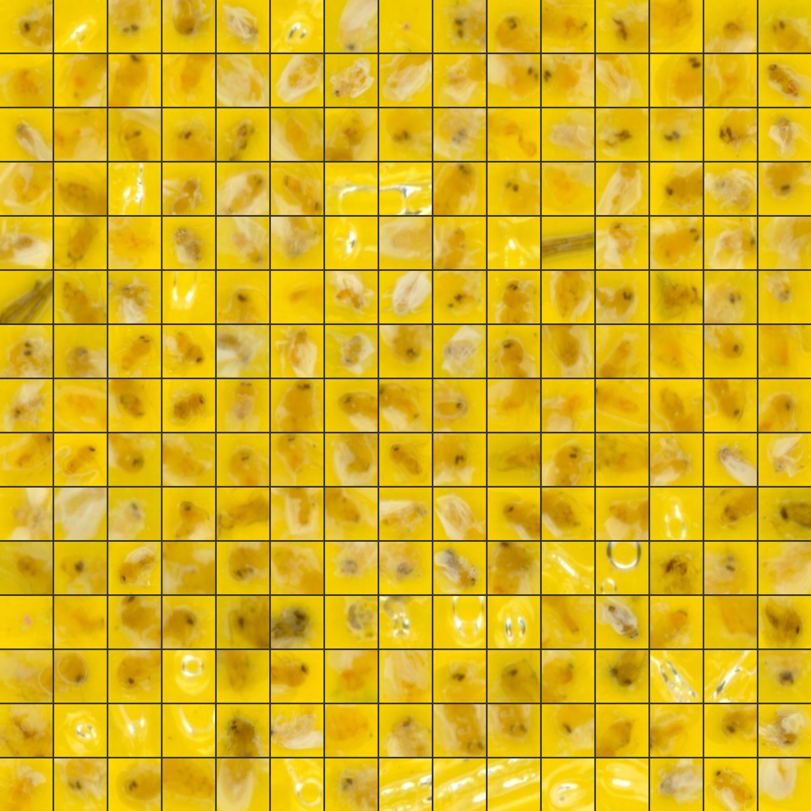 | 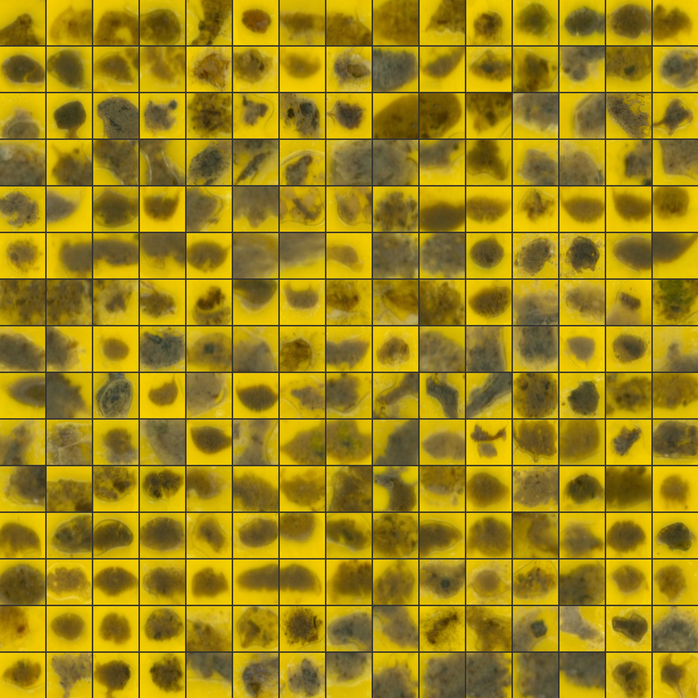 | 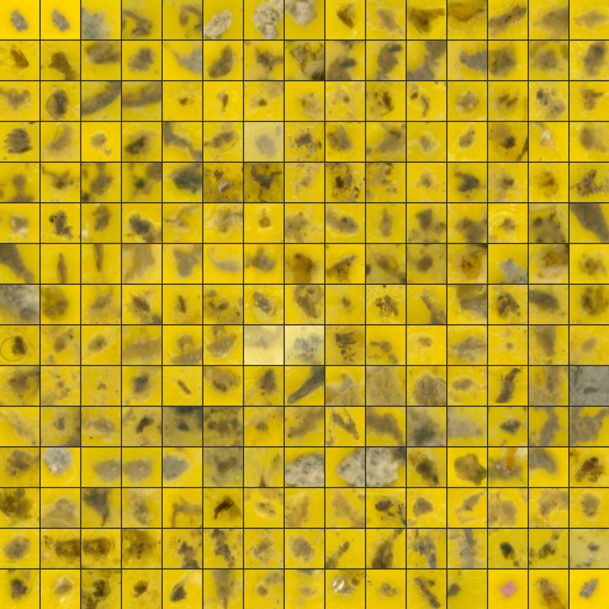 |

> 完整解析度預覽圖見 `Secu-revised/cluster8_preview/`。

---

## 引用

本專案的聚類演算法基於以下論文：

```bibtex
@inproceedings{qian2023secu,
  author    = {Qi Qian},
  title     = {Stable Cluster Discrimination for Deep Clustering},
  booktitle = {{IEEE/CVF} International Conference on Computer Vision, {ICCV} 2023},
  year      = {2023}
}
```
